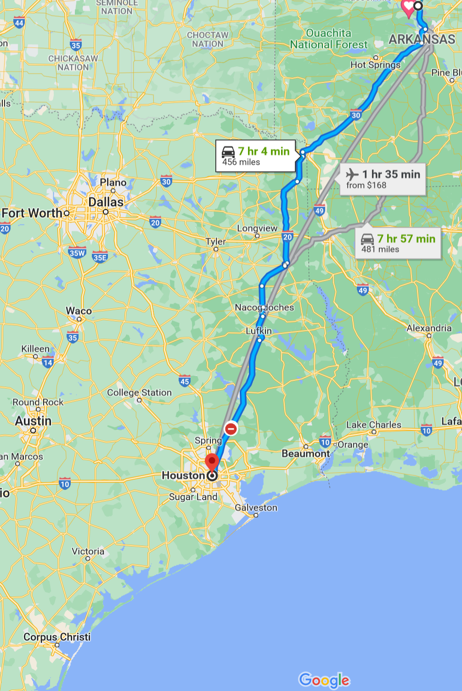
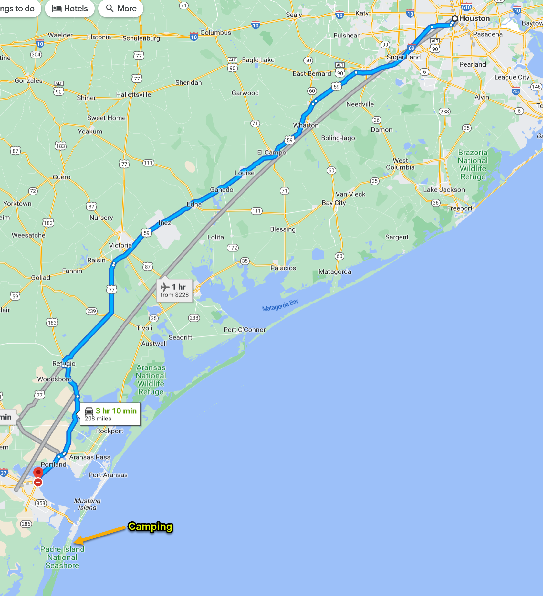
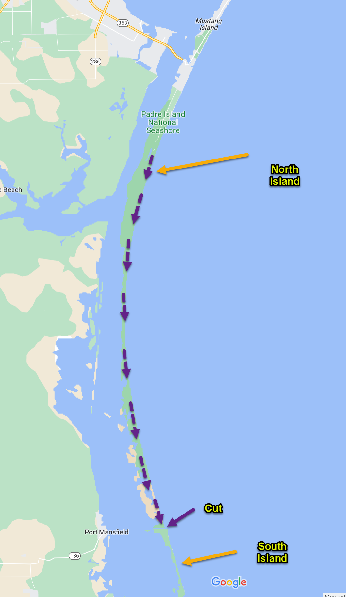

# Padre Island Campout 

Nasa Moon 2 Mars Festival

World's Longest Island

Sand off-roading

Wilderness - no amenities, electricity or fuel

## Time

03/18/2022 7:00am - 03/25/2022 10:00pm

## Day 1 (03/18) - Houston Drive

**Distance**: 465mi

**Time**: 7hrs

## Day 2 (03/19) - Moon 2 Mars Festival

**Location**: Johnson Space Center

[website](https://spacecenter.org/moon2marsfestival/)

## Day 3 (03/20) - Corpus Christi Drive

Campout at [Padre Island Nation Seashore](https://www.nps.gov/pais/index.htm)

Camping is [free](https://www.nps.gov/pais/planyourvisit/permitsandreservations.htm)

**Distance**: 208mi

**Time**: 3hrs

## Day 4 - 7  (03/21 - 03/24) - Corpus Christi Drive

**Distance**: 150mi

[Drive and camp down beach of north island.](https://www.nps.gov/pais/planyourvisit/safety.htm)

The cut between the islands is impassible so once we reach it we will need to turn around and drive north to Corpus Christi.

The park is a wilderness area and there will not be any amenities or gas stations. Everything must be prepared ahead of time.

## Day 8 (03/25) - Return Home

**Distance**: 666mi

**Time**: 11hrs